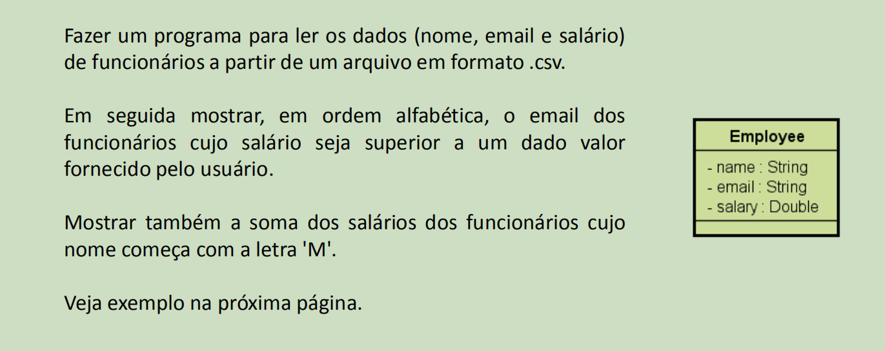
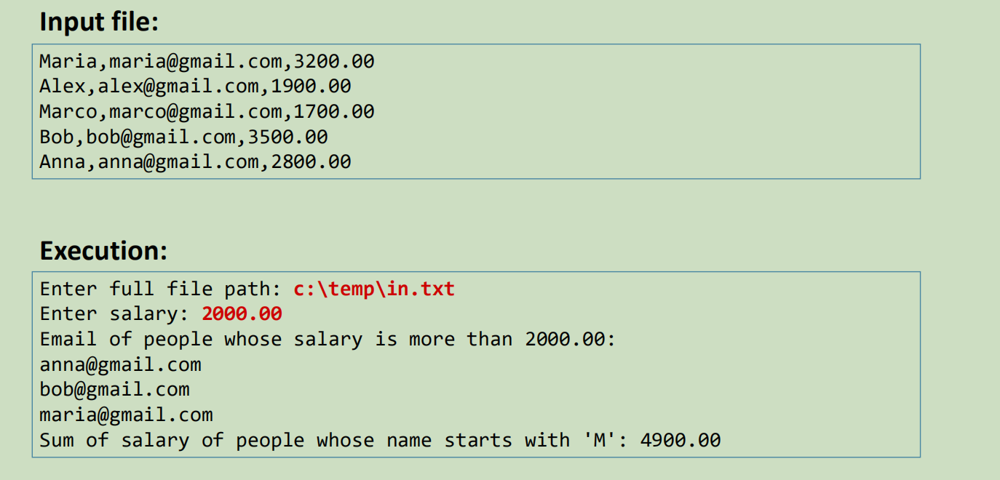

# Sistema de Consulta de Funcionários

É uma atividade do *Módulo 17* do curso de `C# Completo Programação Orientada a Objetos (POO)` Do professor `Nélio Alves`. 
Curso existente na plataforma [Udemy](https://www.udemy.com/course/programacao-orientada-a-objetos-csharp/).

* Implementar um sistema que realiza consultas em uma lista de Funcionários;
* Implementar e entender conceitos como: Expressões lambda, delegates e LINQ;
* Revisar outros conteúdos já vistos no curso.

## Exercício

### Problemática:

### Exemplo para teste:

## Dados do Autor

Autor: `Matheus Glauber Rodrigues Jordão` [Linkedin](https://www.linkedin.com/in/matheusglauber/).
